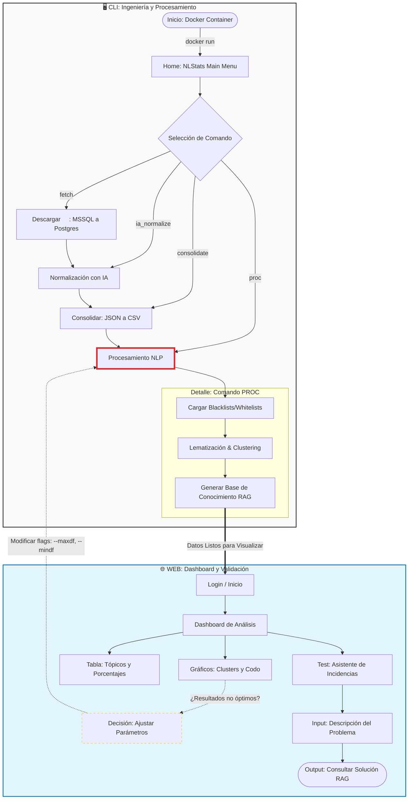

```mermaid 
  flowchart TD
    %% SUBGRAFO: ENTORNO DE CONSOLA (CLI)
    subgraph CLI ["🖥️ CLI: Ingeniería y Procesamiento"]
        direction TB
        A([Inicio: Docker Container]) -->|docker run| B[Home: NLStats Main Menu]
        B --> C{Selección de Comando}
        
        %% Ramas de Comandos
        C -->|fetch| D[Descargar     : MSSQL a Postgres]
        C -->|ia_normalize| E[Normalización con IA]
        C -->|consolidate| F[Consolidar: JSON a CSV]
        C -->|proc| G[Procesamiento NLP]

        %% Detalles del proceso PROC
        subgraph NLP_Process ["Detalle: Comando PROC"]
            G1[Cargar Blacklists/Whitelists]
            G2[Lematización & Clustering]
            G3[Generar Base de Conocimiento RAG]
        end
        
        D --> E --> F --> G
        G --> G1 --> G2 --> G3
    end

    %% CONEXIÓN: Los datos procesados alimentan la web
    G3 ==>|Datos Listos para Visualizar| H

    %% SUBGRAFO: ENTORNO WEB (GUI)
    subgraph WEB ["🌐 WEB: Dashboard y Validación"]
        H[Login / Inicio] --> I[Dashboard de Análisis]
        
        %% Visualización
        I --> J[Gráficos: Clusters y Codo]
        I --> K[Tabla: Tópicos y Porcentajes]
        
        %% Loop de Refinamiento
        J -.->|¿Resultados no óptimos?| L[Decisión: Ajustar Parámetros]
        L -.->|Modificar flags: --maxdf, --mindf| G
        
        %% Testing
        I --> M[Test: Asistente de Incidencias]
        M --> N[Input: Descripción del Problema]
        N --> O([Output: Consultar Solución RAG])
    end

    %% Estilos para visualización
    style CLI fill:#f9f9f9,stroke:#333,stroke-width:2px
    style WEB fill:#e1f5fe,stroke:#0277bd,stroke-width:2px
    style G stroke:#d32f2f,stroke-width:4px
    style L stroke:#fbc02d,stroke-dasharray: 5 5
```
